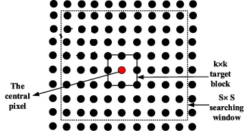
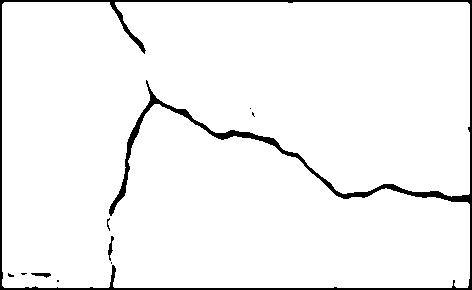
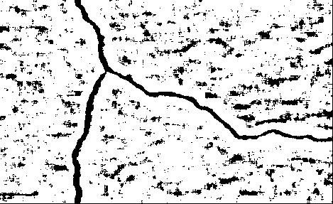

# crack_detection
a ML based pavement crack detection 

## data prepration 

- Positive samples: patch with black pixels (crack) at center  
- Negative samples: patch with white pixels (non-crack) at center

- CNN: multi-label classification 
     - Input : SxS patch around a sample (shape: SxSx3)
 
     - Output: structure around the sample in a KxK patch (shape: K^2 )
     
- HOG: binary classification 
     - Input : HOG features from   SxS patch around a sample
     
     - Output: class label of the sample (crack: c=0, non-crack: c=1)
     - 

- data collection 

## Testing on an image

- Use each pixel to generate an input patch 
- Predict output value  for each patch 

- For HOG:
     - if output > 0.5 ==> pixel is crack
     - if output < 0.5 ==> pixel is non-crack

- For CNN:
     - multiple output values (overlapping)
     - at each pixel ouput value is affected from KxK surrounding pixels
     - summation and normalization ==> probability map
     - if pmap > 0.5 ==> pixel is crack
     - if pmap < 0.5 ==> pixel is non-crack
     - 
- Results: CNN 
 
- Results: HOG 

